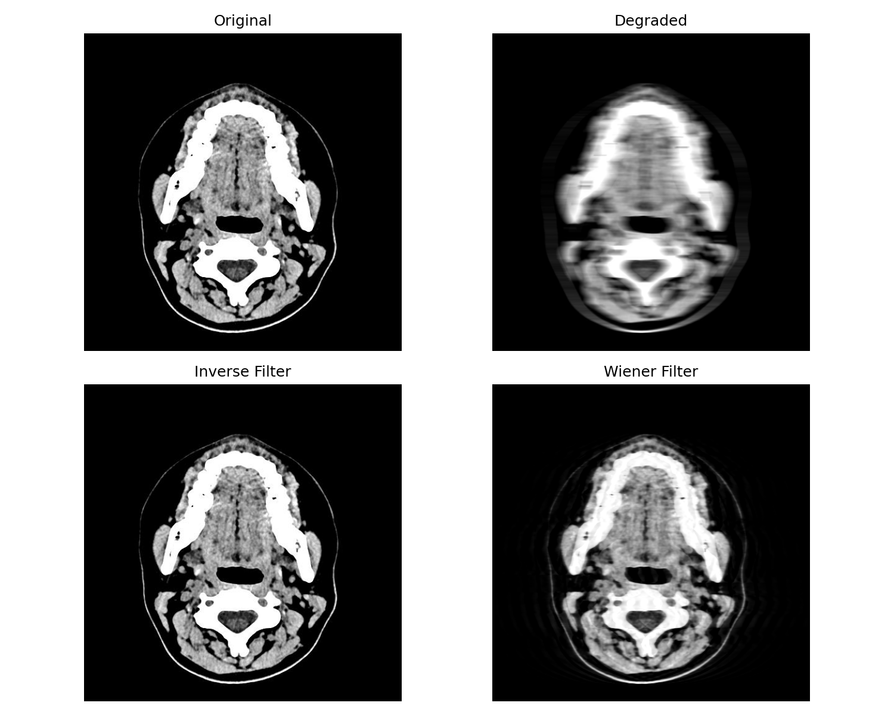
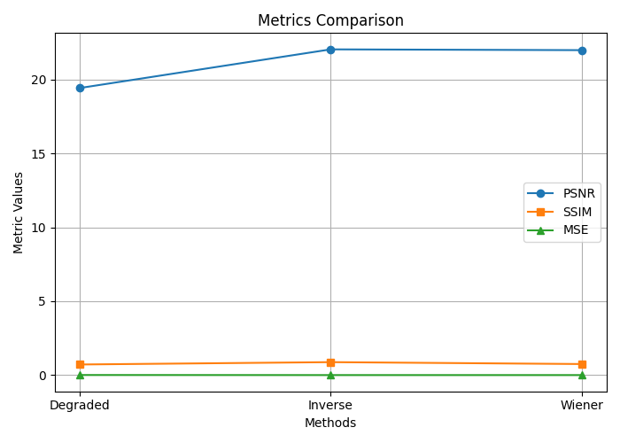

# motion-deblur-filtering


---

##  Experiments

- **Degradation**: Images are blurred using a known kernel (e.g., Gaussian) and corrupted with Gaussian noise.
- **Filtering**:
    - Inverse filter applied in the frequency domain.
    - Wiener filter applied using estimated noise and signal power.
- **Evaluation Metrics**:
    - PSNR (Peak Signal-to-Noise Ratio)
    - SSIM (Structural Similarity Index)
    - MSE (Mean Squared Error)

---

## Usage Example



##  Results

| Filter     | PSNR (dB) | SSIM | MSE    |
|------------|-----------|------|--------|
| Inverse    | 22.1      | 0.88 | 0.0062 |
| Wiener     | 21.98     | 0.75 | 0.0063 |



---

##  Installation

1. Clone the repository:
```bash
https://github.com/SinaDns/motion-deblur-filtering.git
```
2. Install Dependencies:
```bash 
pip install -r requirements.txt
```
## Running
3. Running the Code:
```bash
python src/main.py
```
## Reports
The full analysis and results are in the [report](reports). 

